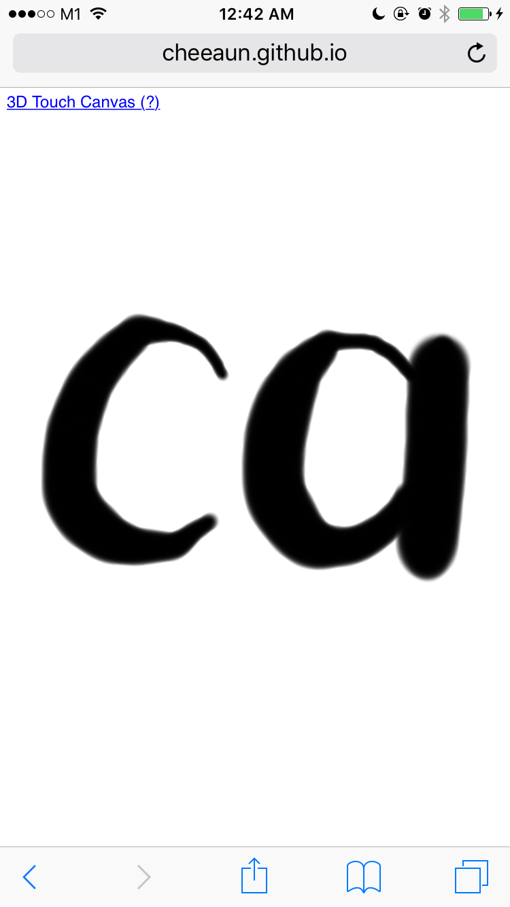

3D Touch Canvas
===

This is a demo for 3D Touch on Mobile Safari on iPhone 6S and 6S Plus. It's a simple line drawing app which you can use the force of the finger to control the width of the drawn line.

Mobile Safari on iOS 9 for iPhone 6S and 6S Plus introduces [3D Touch for web developers](http://www.mobilexweb.com/blog/ios9-safari-for-web-developers). The line drawing code is heavily inspired by (or copied from) @kangax's 2013 article: [Exploring canvas drawing techniques](http://perfectionkills.com/exploring-canvas-drawing-techniques/).

Demo URL: https://cheeaun.github.io/3d-touch-canvas/

Here's how it looks like, with a sketch:

And here's a nice demo video: https://twitter.com/cheeaun/status/656631323923091456

Instructions
---

- Touch anywhere to start drawing lines (except the top link).
- Two-finger tap to clear canvas.
